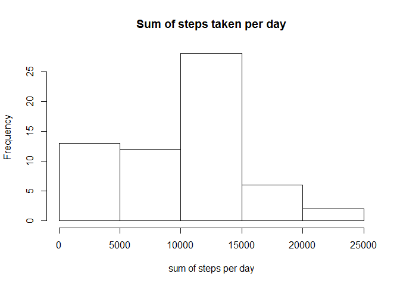
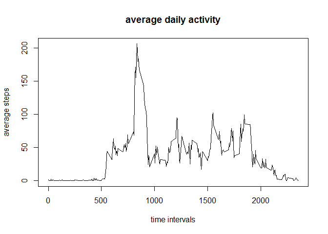
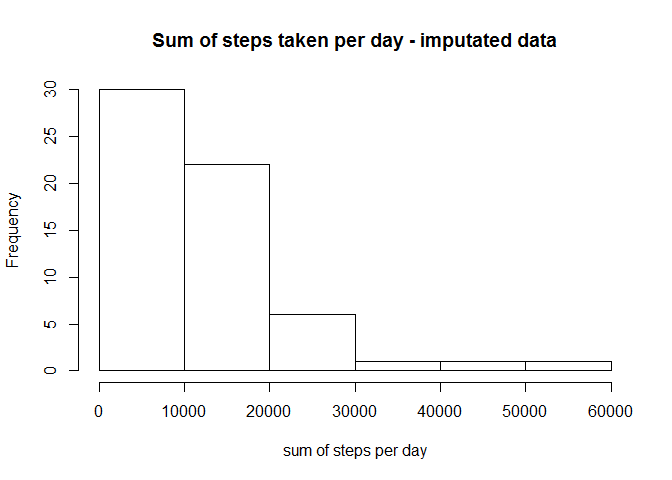
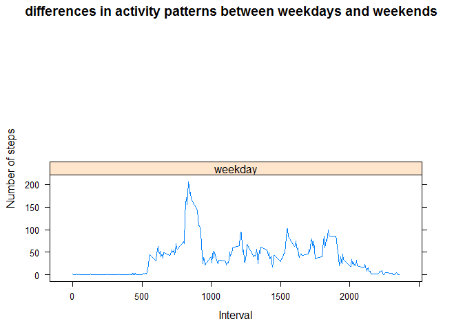

# Reproducible Research: Peer Assessment 1


## Loading and preprocessing the data

```r
#setwd('../RepData_PeerAssessment1')
activity <- read.csv(unz('activity.zip','activity.csv'),header = T)
activity$date <- as.Date (activity$date)
```


## What is mean total number of steps taken per day?


```r
stepsSum <- aggregate(activity$steps,by = list(activity$date),FUN=sum, na.rm=T)

hist(stepsSum[,2],xlab= 'sum of steps per day',main='Sum of steps taken per day' )
```

 

```r
mean(stepsSum[,2])
```

```
## [1] 9354.23
```

```r
median(stepsSum[,2])
```

```
## [1] 10395
```


## What is the average daily activity pattern?


```r
avgDailyActivity <- aggregate(activity$steps,by = list(activity$interval),FUN=mean, na.rm=T)

plot(avgDailyActivity,type = 'l', ylab = 'average steps', xlab = 'time intervals',main='average daily activity')
```

 

```r
avgDailyActivity[which.max(avgDailyActivity[,2]),1]
```

```
## [1] 835
```


## Imputing missing values


```r
sum(is.na(activity$steps))
```

```
## [1] 2304
```

```r
avgDailyActivity <- aggregate(activity$steps,by = list(activity$interval),FUN=mean, na.rm=T)

activityNew <- merge(activity,avgDailyActivity, by.x=c('interval'), by.y = c('Group.1'))

activityNew$steps <- ifelse(is.na(activityNew$steps)==T,activityNew$x,activityNew$steps)

activityNew<-activityNew[,-4]

stepsSum <- aggregate(activityNew$steps,by = list(activity$date),FUN=sum, na.rm=T)

hist(stepsSum[,2],xlab= 'sum of steps per day',main='Sum of steps taken per day - imputated data')
```

 

```r
mean(stepsSum[,2])
```

```
## [1] 10766.19
```

```r
median(stepsSum[,2])
```

```
## [1] 10351.62
```


## Are there differences in activity patterns between weekdays and weekends?

```r
activityNew$dayType <- as.factor(ifelse(weekdays(activityNew$date,abbreviate=T) %in% c('Sat','Sun'),'weekend','weekday'))

avgDailyActivity <- aggregate(activityNew$steps,by = list(activityNew$interval,activityNew$dayType),FUN=mean, na.rm=T)

xyplot(x ~ Group.1| levels(Group.2), 
           data = avgDailyActivity,
           type = "l",
           xlab = "Interval",
           main = 'differences in activity patterns between weekdays and weekends',
           ylab = "Number of steps",
           layout=c(1,2))
```

 
